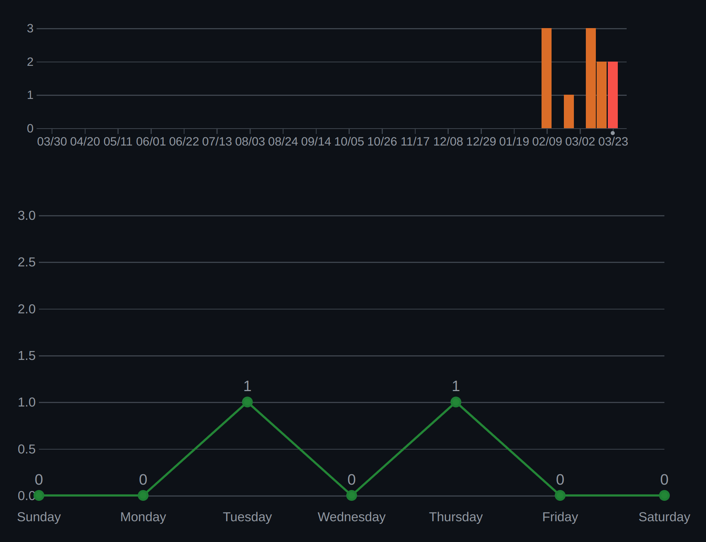
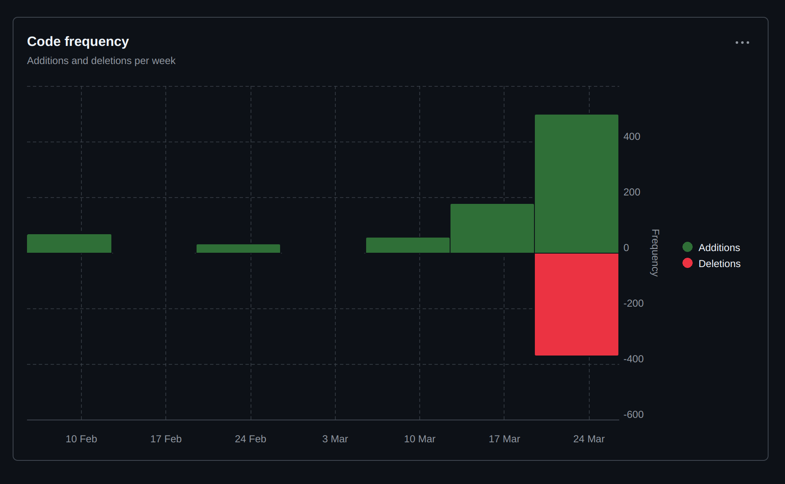

# Sprint 1

**Name:** Martin Rammerstorfer

**Klasse:** 2BHITM

**Thema:** Star Trek

**Repo:** https://github.com/htl-leo-medtwt-projects/2425-sommerprojekt-2bhitm-martin-rammerstorfer.git

## Änderungen

* Dateistruktur

* Header

* Dark Mode

* Grundlegendes Startseitenlayout

## Screenshots

## Ziele

* Fertigstellung und Befüllung der Startseite

* Einbindung von GSAP

* Anlegen der JSONs für Characters und Media

* Anzeigen der Daten inkl. Filteroptionen
