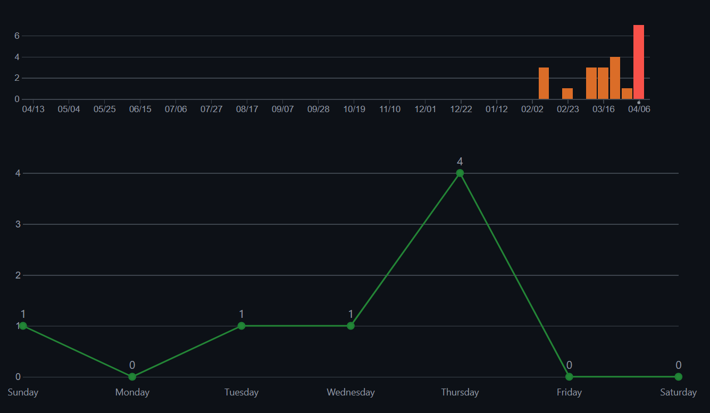
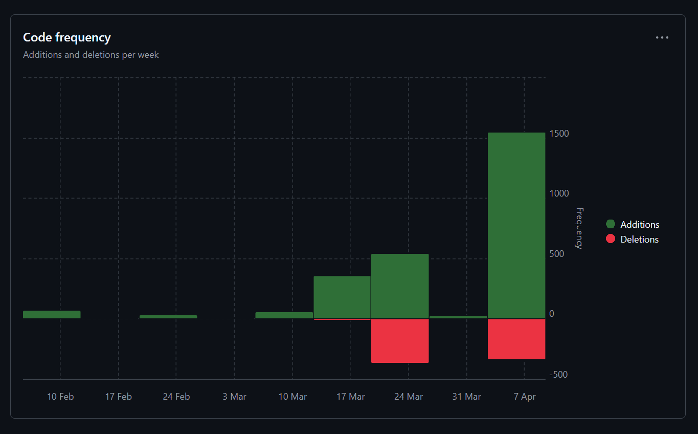

# Sprint 2

**Name:** Martin Rammerstorfer

**Klasse:** 2BHITM

**Thema:** Star Trek

**Repo:** https://github.com/htl-leo-medtwt-projects/2425-sommerprojekt-2bhitm-martin-rammerstorfer.git

## Änderungen

* Startseite mit Text befüllt und verschönert

* Allgemeines Layout leicht verbessert

* JSONs befüllt (Characters und Media)

* Daten auf Seiten mit grundlegenden Filteroptionen ausgegeben

* GSAP eingebunden und verwendet

Meine Ziele habe ich damit erreicht.

## Screenshots

## Ziele

* Mehr Charaktere hinzufügen

* Pop-ups beim Klicken auf Charaktere und Serien mit detaillierteren Informationen

* Filteroptionen weiter ausarbeiten und Suchen/Sortieren ermöglichen

* GSAP auch auf der Startseite einbauen, mit sich bewegenden Elementen im Hintergrund

* Text für Geschichte-Seite recherchieren und mit der Ausgabe anfangen, möglicherweise mit Fullpage.js
