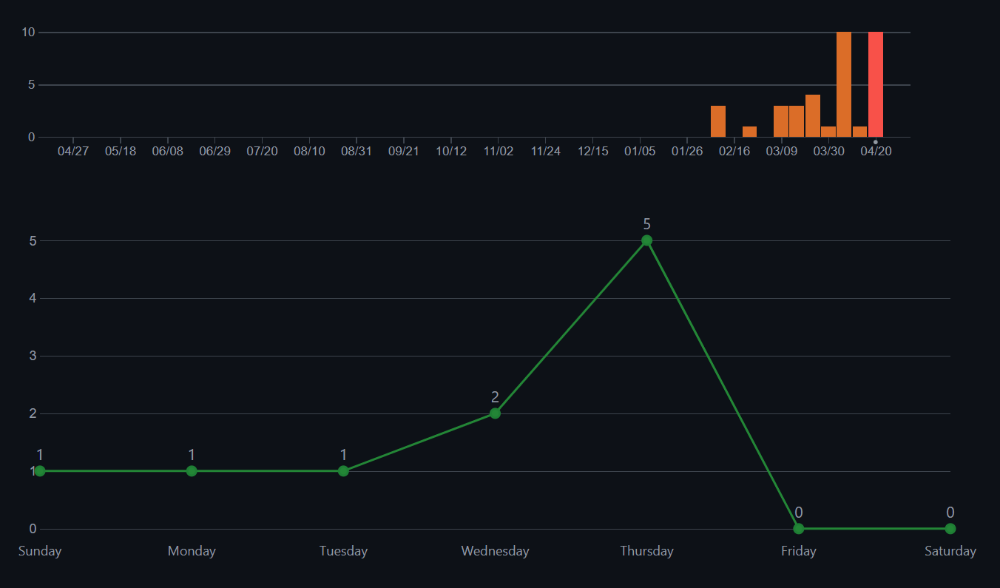
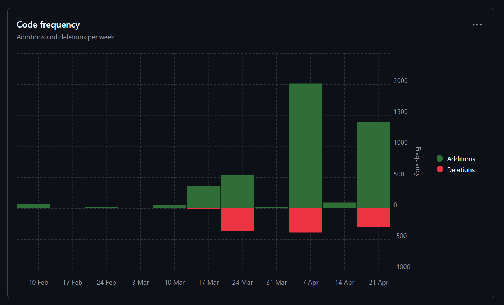

# Sprint 3

**Name:** Martin Rammerstorfer

**Klasse:** 2BHITM

**Thema:** Star Trek

**Repo:** https://github.com/htl-leo-medtwt-projects/2425-sommerprojekt-2bhitm-martin-rammerstorfer.git

## Änderungen

* GSAP und Hintergrundelemente auf der Startseite eingebaut

* mehr Charaktere hinzugefügt

* Suchfeld verbessert und Sortierung bei Media-Seite

* sessionStorage für Dark Mode

* JSON mit Daten für History-Seite befüllt

## Screenshots

## Ziele

* Ausgabe auf History-Seite

* Querverlinkungen zwischen Unterseiten (Media, Characters, History)

* Image-Slider auf Characters-Seite

* Grundlage für Spielseite (Fullscreen, Audio-Button, Title Screen)
