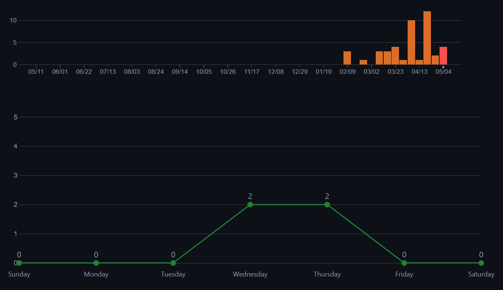
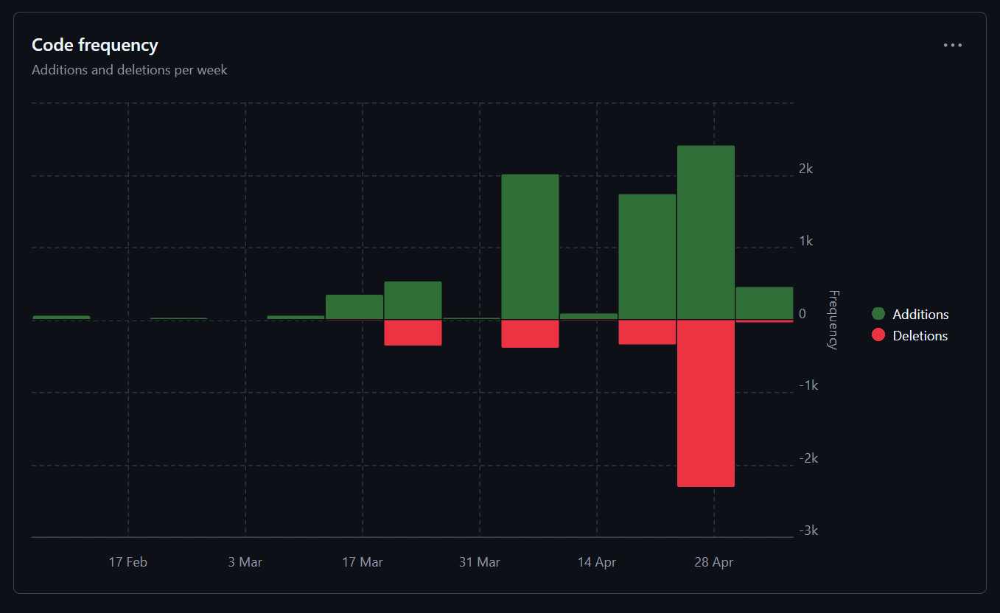

# Sprint 4

**Name:** Martin Rammerstorfer

**Klasse:** 2BHITM

**Thema:** Star Trek

**Repo:** https://github.com/htl-leo-medtwt-projects/2425-sommerprojekt-2bhitm-martin-rammerstorfer.git

## Änderungen

* Ausgabe auf History-Seite fertiggestellt, inkl. Bildern und Videos

* Image-Slider und Reset-Button bei Characters sowie Keybinds (links & rechts, Escape)

* Mehr Bilder bei einigen Charakteren eingebaut

* Grundlage für Game-Seite erstellt

* Verlinkung von Characters- und History-Seiten auf Media-Seite

## Screenshots

## Ziele

* Fertigstellung des Spiels (Side-Scroller)

* Responsive Design

* Audios bei einigen Charakteren
